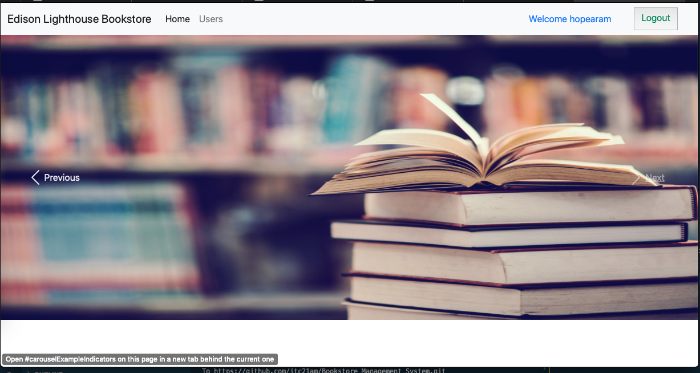
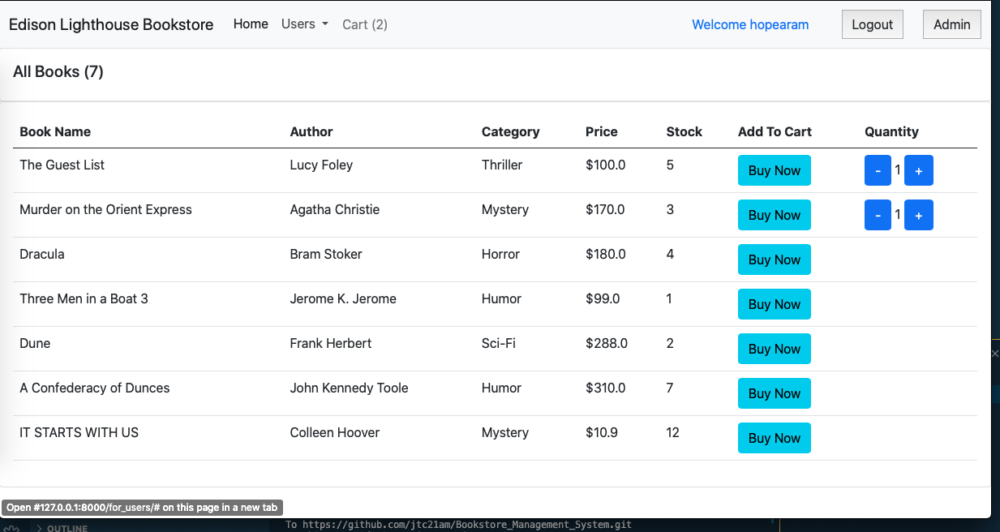
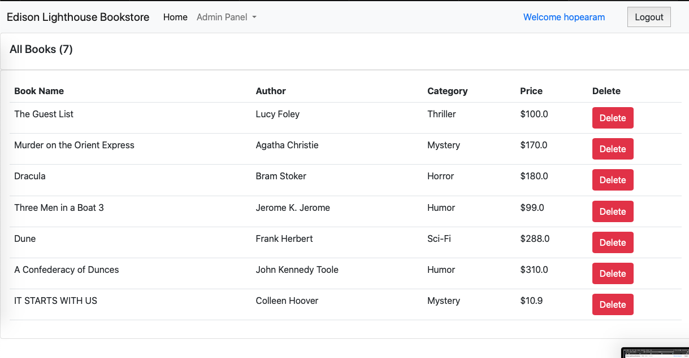
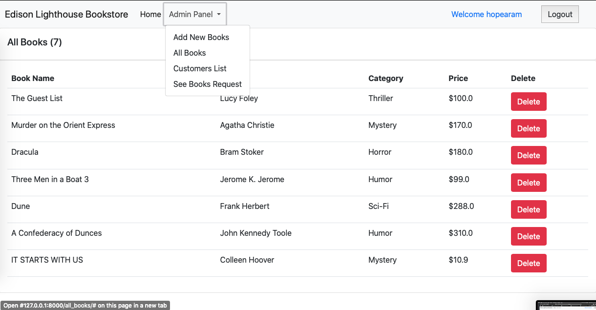
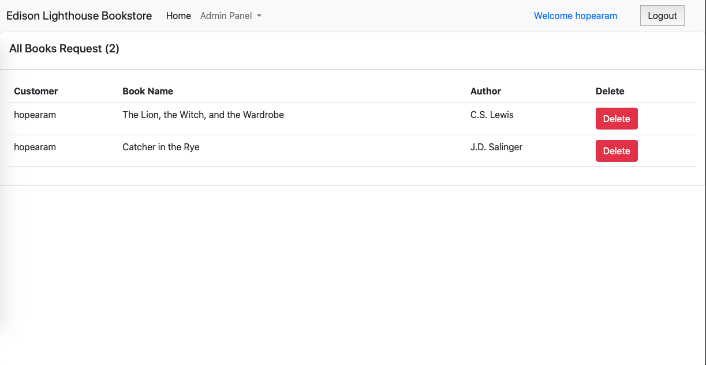

# Bookstore Management System

A bookstore management system using Python Django where the customer can purchase books.  Admin module to handle the entire system made in Django to handle back-end databases.

About the Django Bookstore Management System Project

With this project, it will be very easy to manage all the records in a bookstore.  

## Features

The customer can:
Purchase books from the books list
Able to request for a book which is not available in the books list

The admin of the bookstore can:
Add new books or delete a book from the list
See all the requested books by the customers
See all the customers listed with their orders

